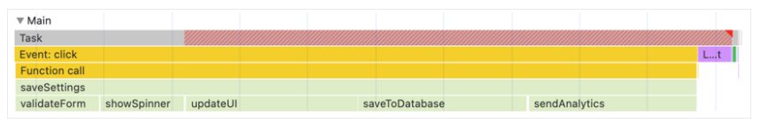
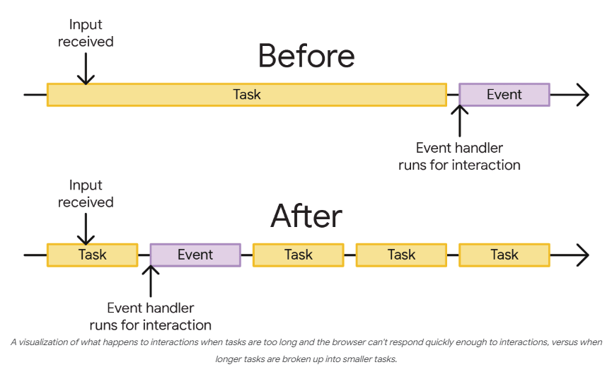
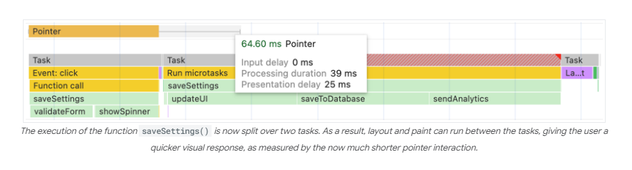
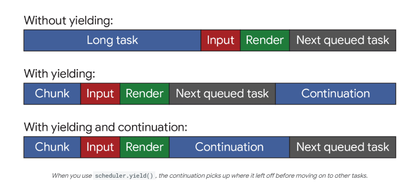

## Network

### Timing breakdown phases explained

Here is more information about each of the phases you may see in the **Timing** tab:

* **Queueing**: The browser queues requests before connection start and when:
    * There are higher priority requests. Request priority is determined by factors such as the type of resource, as
      well as its location within the document.
    * There are already six TCP connections open for this origin, which is the limit. (Applies to HTTP/1.0 and HTTP/1.1
      only.)
    * The browser is briefly allocating space in the disk cache.
* **Stalled**: The request could be stalled after connection start for any of the reasons described in **Queueing**.
* **DNS Lookup**: The browser is resolving the request's IP address.
* **Initial connection**: The browser is establishing a connection, including TCP handshake or retires and negotiating
  an SSL.
* **Proxy negotiation**: The browser is negotiating the request with a proxy server.
* **Request sent**: The request is being sent.
* **ServiceWorker Preparation**: The browser is starting up the service worker.
* **Request to ServiceWorker**: The request is being sent to the service worker.
* **Waiting (TTFB)**: The browser is waiting for the first byte of a response. TTFB stands for Time To First Byte. This
  timing includes one round trip of latency and the time the server took to prepare the response.
* **Content Downloaded**: The browser is receiving the response, either directly from the network or from a service
  worker. This value is the total amount of time spent reading the response body. Larger than expected values could
  indicate a slow network, or that the browser is busy performing other work which delays the response from being read.

## Optimize long tasks

Source:

* [optimize-long-tasks](https://web.dev/articles/optimize-long-tasks?utm_source=devtools)
* [main-thread](https://web.dev/articles/off-main-thread)

Common advice for keeping JavaScript apps fast tends to boil down to the following advice:

* Don't block the _main thread_,
* Break up your long tasks (_> 50ms_).

**Shipping _less_ JavaScript is good**.

### What is a task?

A _task_ is any piece of work that the browser does. That work includes **rendering**, **parsing HTML and CSS**, *
*running JavaScript**, and other types of work you may not have direct control over. Of all of this, the JavaScript you
write is perhaps the largest source of tasks.

Tasks associated with JavaScript impact performance in a couple of ways:

* When a browser downloads a JavaScript file during startup, it queues tasks to parse and compile that JavaScript so it
  can be executed later.
* At other times during the life of the page, tasks are queued when JavaScript does work such as responding to
  interactions through event handlers, JavaScript-driven animations, and background activity such as analytics
  collection.

(_Almost_) All of this stuff happens on the **main thread**.

### What is the main thread?

The _main thread_ is where most tasks run in the browser, and where almost all JavaScript you write is executed.
JavaScript is **single-thread** language.

The main thread can only process one task at a time. Any task that takes longer than 50 milliseconds is a _long task_.
For tasks that exceed 50 milliseconds, the task's total time minus 50 milliseconds is known as the task's _blocking
period_.

When a user attempts to interact with a page when there are many long tasks, however, the user interface will feel
unresponsive, and possibly even broken if the main thread is blocked for very long periods of time.

In Chrome's performance profiler - Long tasks are indicated by a red triangle in the corner of the task, with the
blocking portion of the task filled in with a pattern of diagonal red stripes.


To prevent the main thread from being blocked for too long, you can break up a long task into several smaller ones.


### Task management strategies

A common piece of advice in software architecture is to break up your work into smaller unctions:

```js
function saveSettings() {
    validateForm();
    showSpinner();
    saveToDatabase();
    updateUI();
    sendAnalytics();
}
```

In this example, `saveSettings()` function that calls five functions, is well-architected. Breaking up work like this
makes projects easier to navigate and maintain.

A potential problem here, though, is that JavaScript doesn't run each of these functions as separate tasks because they're executed within the common `saveSettings()` function. **This means that all five functions will run as one task.**
_The work is run as part of one long monolithic task, blocking any visual response until all five functions are
complete._

In this case, `saveSettings()` is triggered by a user click, and because the browser isn't able to show a response until
the entire function is finished running, the result of this long task is a slow and unresponsive UI, and will be
measured as a poor **Interaction to Next Paint (INP)**.

**Key point:** JavaScript works this way because it uses the _run-to-completion model_ of task execution. This means
that each task will run until it finishes, regardless of how long it may block the main thread.

### Manually defer code execution

To make sure important user-facing tasks and UI responses happen before lower-priority tasks, you can _yield to the main
thread_ by briefly interrupting your work to give the browser opportunities to run more important tasks.

One method developers have used to break up tasks into smaller ones involves `setTimeout()`. With this technique, you
pass the function to `setTimeout()`. This postpones execution of the callback into a separate task, even if you specify
timeout of `0`.

```js
function saveSettings() {
    // Do critical worj that is user-visible:
    validateForm();
    showSpinner();
    updateUI();

    // Defer work that isn't user-visible to a separate task:
    setTimeout(() => {
        saveToDatabase();
        sendAnalytics();
    }, 0);
}
```

This is known as _yielding_, and it works best for a series of functions that need to run sequentially.

**Key point:** When you yield to the main thread, you're giving it an opportunity to handle more important tasks than
the ones that were initially queued up. You should ideally yield to the main thread whenever you have user-facing-work
such as updating the UI that should execute sooner than if you didn't yield.

Using `setTimeout()` also has drawback when it comes to yielding: when you yield to the main thread by deferring code to
run in a subsequent task using `setTimeout()`, that task gets added to the _end_ of the queue. If there are other tasks
waiting, they will run before your deferred code. For example, if we have five `setTimeout()` with timeout set to `0`, the
browser will start imposing a minimum 5-millisecond delay for each `setTimeout()`.

### A dedicated yielding API: `scheduler.yield()`

`scheduler.yield()` is an API specifically designed for yielding to the main thread in the browser. `scheduler.yield()`
is just a function that returns a `Promise` that will be resolved in a future task. Any code chained to run after that
`Promise` is resolved (either in an explicit `.then()` chain or after `await`ing it in an `async` function) will then
run
in that future task.

```js
async function saveSettings() {
    // Do critical work that is user-visible:
    validateForm();
    showSpinner();
    updateUI();

    // Yield to the main thread:
    await scheduler.yield();

    // Work that isn't user-visible, continued in a separate task:
    saveToDatabase();
    sendAnalytics();
}
```



**Key point:** You don't have to yield every function call. For example, if you run two functions that both result in
critical updates to the user interface, you probably don't want to yield in between them. If you can, let that work run
first, then consider yielding in between functions that do less critical or background work that the user doesn't see.

The real benefit of `scheduler.yield()` over other yielding approaches, though, is that its **continuation is
prioritized**, which means that if you yield in the middle of a task, the continuation of the current task will run
**before** any other similar tasks are started.

This avoids code from other task sources from interrupting the order of your code's execution, such as a task from
third-party scripts.


### Cross-browser support

