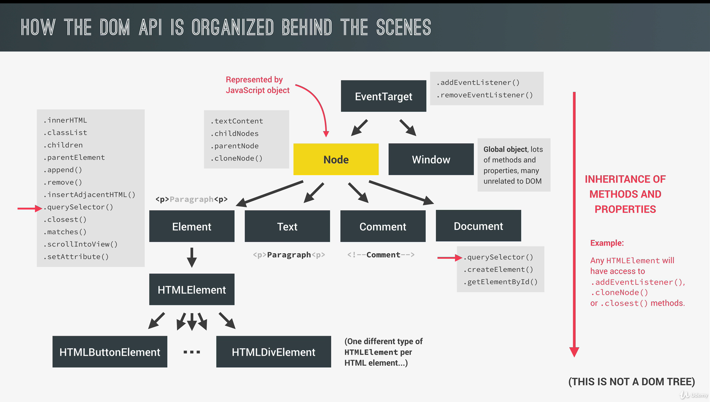
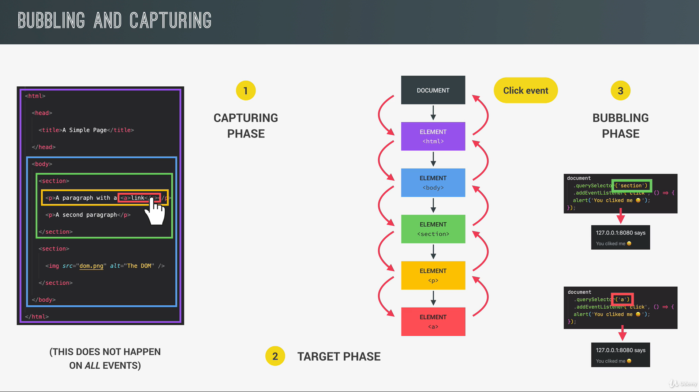

# DOM Advanced

## What is the DOM?

JS <-- DOM (interface) --> BROWSER

- Allows us to make JavaScript interact with the browser;
- We can write JavaScript to **create, modify and delete HTML elements**; set styles, classes and attributes; and listen
  and
  respond to events;
- DOM tree is generated from an HTML document, which can then interact with;
- DOM is a very complex API that contains lots of methods and properties with the DOM tree.

## DOM Organization

### Node:

1. Element
2. Text
3. Comment
4. Document

**Node Methods:** `.textContent`, `.childNodes`, `.parentNode`, `.cloneNode()`.

**Element Methods:** `.innerHTML`, `.classList`, `.children`, `.parentElement`, `.append()`, `.remove()`,
`.insertAdjacentHTML()`, `.querySelector()`, `.closest()`, `.matches()`, `.scrollIntoView()`, `setAttribute()`.

### Inheritance of methods and properties

Any HTMLElement will have access to `.addEvenetListener()`, `.cloneNode()` or `.closest()` methods.


## Capturing vs Bubbling

**Capturing phase** event traveling down from the DOM.

**Bubbling phase** event is traveling back up.



By default, `addEventListener` is listening for a bubbling events, and **NOT** capturing events.
If we want to catch events during the _CAPTURING_ phase instead, we simply add(set) third parameter -> `true`.

With this, we are listening for events going **down** from the DOM tree...

Capturing: from the document root all the way down to the target.

DEFAULT behaviour:
Receive events from target elements and from **BUBBLING** phase.

When third parameter is set to `true`:

```js
element.addEventListener("click", (e) => {
}, true);
```

that means:
Element is now listening for the event as it travels down from the (top) DOM, while other ones (default behaviour)
are listening for the event as it travels back up -> they are looking for bubbling events, that's why they're going to
happen after.

```js
navLinks.addEventListener("click", function (e) {
    this.style.backgroundColor = randomColor();
    console.log("NAV LINKS EVENT: ", e.target)// will log the element where CLICK (EVENT) happened -> bubbling
    console.log("NAV LINKS EVENT: ", e.target, e.currentTarget)
    console.log(this === e.currentTarget) // always returns true!
}, true);

navLink.addEventListener("click", function (e) {
    this.style.backgroundColor = randomColor();
    // console.log("LINK EVENT: ", e.target) // will log the element where CLICK (EVENT) happened -> bubbling
    console.log("LINK EVENT: ", e.target, e.currentTarget)

    // Stop propagation
    // e.stopPropagation()
});

navLinks.addEventListener("click", function (e) {
    this.style.backgroundColor = randomColor();
    // console.log("NAV LINKS EVENT: ", e.target)// will log the element where CLICK (EVENT) happened -> bubbling
    console.log("NAV LINKS EVENT: ", e.target, e.currentTarget)
    console.log(this === e.currentTarget) // always returns true!
});

nav.addEventListener("click", function (e) {
    this.style.backgroundColor = randomColor();
    // console.log("NAV EVENT: ", e.target)// will log the element where CLICK (EVENT) happened -> bubbling
    console.log("NAV EVENT: ", e.target, e.currentTarget)
});
```


