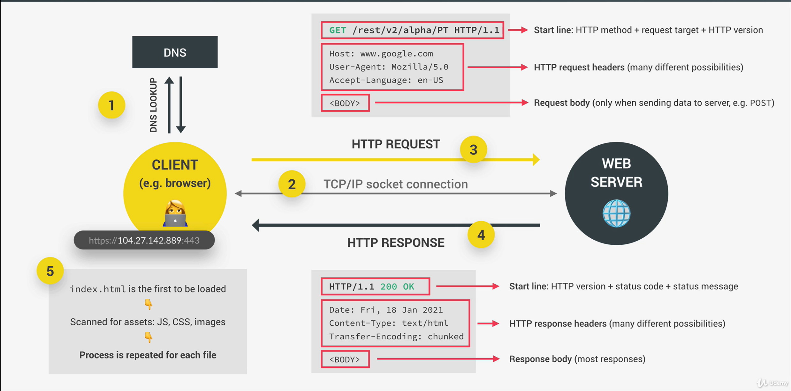

# Asynchronous code

## SECTION 16

### Synchronous code

Synchronous code is **executed line by line**.

Thread of execution is part of execution context that actually executes the code in computer's CPU .

### Asynchronous code

* Asynchronous code is executed **after a task that runs in the "background" is finished**;
* Asynchronous code is **non-blocking**;
* Execution doesn't wait for an asynchronous task to finish its work;

```js
const firstName = "My Name"; // (1)
setTimeout(() => {
    console.log("Asynchronous code"); // (3) this code is asynchronous and will be executed after 4sec, but will not block the rest of the coming code.
}, 4000);

console.log(firstName); // (2)
```

### API Application Programming Interface

API is a piece of software that can be used by another piece of software, in order to allow **applications to talk to each
other**; _DOM API, WEB API (Online API), Geolocation API_.

Most popular **API data format** is JSON data format.

### Fetching data asynchronously - Old Way (AJAX)

```js
const request = new XMLHttpRequest();

console.log(request);

request.open("GET", "https://public-api-url");
request.send();

// load event - as soon as data is fetched
request.addEventListener("load", function () {
    console.log(this.responseText);

    const data = JSON.parse(this.responseText);

    console.log(data);
});
```

### How the WEB works regarding requests and responses

💻**Client** (e.g. browser) -----------> **WEB Server**🌐 (_request_);

💻**Client** (e.g. browser) <----------- **WEB Server**🌐 (_response_);

#### 1. DNS lookup: DNS lookup convert domain name to real domain address - IP address

💻**Client** ----> **DNS** (_request_);

💻**Client** <---- **DNS** (_response_);

#### 2. TCP/IP socket connection: connection between client and web server (Transmission Connection Protocol / Internet Protocol). Communication protocols, setting rules how data moves across the internet.

💻**Client** <--------------> **WEB Server**🌐 (_communication_);

#### 3. HTTP Request: Requesting something (on the client side) from the server: Start Line, HTTP request headers, Request body

💻**Client** ---------> **WEB Server**🌐 (_request_);

#### HTTP Response (from web server to client): Start line: HTTP version + status code + status message, HTTP response headers, response body

💻**Client** <--------- **WEB Server**🌐 (_response_);



## Promises And Using FETCH

### Using `fetch` over AJAX

```js
const request = await fetch("https://public-api-url"); // GET request
// console.log(request) // Promise {<pending>};
```

**Promise** is an object that is used as a placeholder for the future result of an asynchronous operation.

Or less formal: **Promise** is a container for an asynchronously delivered value. (Container for the future value.)
Example: Response from AJAX call.

### Why Promises?

* Using Promises, we don't need to rely on the events and callbacks passed to the asynchronous functions to handle async
  results.
* With Promises, we can **chain promises** for a sequence of async operations: **escaping callback hell**.

### The Promise Lifecycle

Promise status:
PENDING --> Async task --> SETTLED (fulfilled, rejected)

* Pending: **Before** the future value is available;
* Settled: Asynchronous task **has finished**;
* Fulfilled: Success! The value is now **available**;
  * Rejected: An **error** happened.

**BUILD PROMISE**

**CONSUME PROMISE**: When we already have a promise. E.g. promise returned from Fetch API.

### Consuming Promises

```js
const getCountryDetails = async function () {
    // handling fulfilled promise:
    const request = await fetch("public-api-url").then((res) => {
        console.log(res);
        return res.json();
    }).then((data) => console.log(data)); // assuming that promise is fulfilled.
}
```

**then()** will always return a Promise, no matter if we pass some data as an argument or not. If we pass data as an
argument, _data_ should be fulfilled result of the returned Promise.

#### Chaining Promises

```js

const getSomething = async function () {
    const request = await fetch("some-url")
        .then(response => response.json())
        .then(data => {
            const request2 = data[0].someParam;

            return fetch(`some-url/${request2}`)
        })
        .then(response => response.json())
        .then(data => console.log(data));
}

getSomething();
```
### Handling Errors in Promises

Using `catch` at the end of `.then()` block;

```js
void(async () => {
  const request = await fetch("url")
          .then(response => {
            if(!response) throw new Error(`Error happend ${response.status}`);

            return response.json();
          })
          .then(data => console.log(data))
          .catch(error => console.error(`Error happend: ${error.message}`));
})();
```

## Asynchronous Behind The Scenes: The Event Loop

Runtime in the browser - "Container" which includes all necessary to execute JS code.
**Engine**: "Hearth" of the runtime.

**Memory Heap**: Where **objects** are stored in memory.

**Call Stack**: Where code is actually executed. Only **ONE** thread of execution. No multitasking!

**WEB APIs**: (DOM, Timers, Fetch API, ...) APIs provided to the engine. Not part of the JavaScript language but browsers.

**Callback Queue**: (click, timer, data) Ready-to-be-executed callback functions (coming from events)

**Event Loop**: Whenever the call stack is empty, Event Loop sends callback(s) from callback queue to Call Stack. Event Loop is an essential piece that makes asynchronous behavior possible in JS. It's the reason why we can have non-blocking model in JavaScript.

Also, we can say that Event Loop decides when each callback is executed.

**Microtasks Queue**: Callbacks of Promises have special queue for themselves. Microtasks Queue has **priority** over Callback Queue.

### Building the Promise

We create a new Promise using `Promise` constructor

We pass exactly one argument - executor function (which includes two parameters - `resolve` & `reject`).

```js
const newPromise = new Promise(function(resolve, reject){
  // should contain async behavior that we are trying to handle with the promise.
  // should produce a result value - future value of the promise.
  // ...some code
  if(Math.random() > 0.5) {
    resolve("You win!")
  } else {
    reject("You lost")
  }
})

newPromise.then(res => console.log(res)).catch(error => console.log(error))
```

The key situations where manually creating Promises makes sense are:
1. When working with callback-based APIs that you want to convert to Promises
2. When you need to handle events that can occur multiple times but you want to resolve only once
3. When implementing custom async behavior that isn't naturally Promise-based
4. When adding additional functionality around existing Promise-based operations (like retries or timeouts)
5. When you need more control over the resolution/rejection timing and conditions

The main principle is: if you're working with operations that are already Promise-based (like `fetch`, `async/await`), you typically don't need to create Promises manually. But when you're working with callbacks, events, or need custom Promise behavior, manual Promise creation is the way to go.


