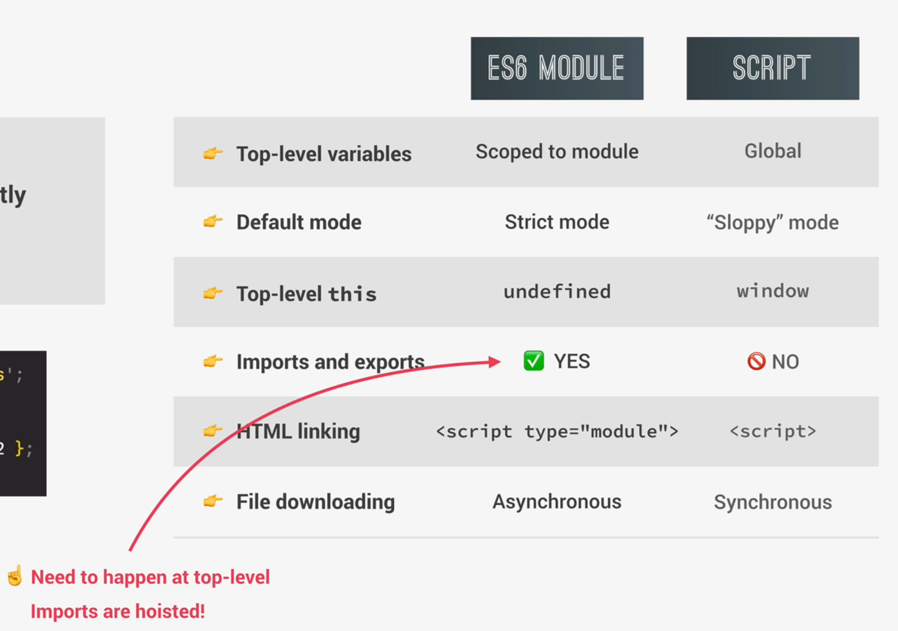
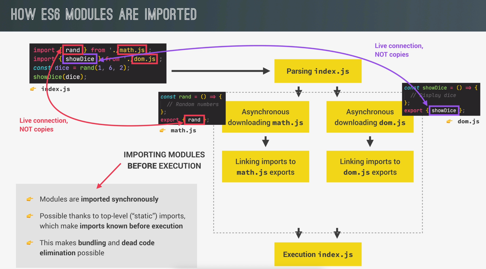

# SECTION 17

### Modules

Instead of writing all code in one big script, today we devide our project into multiple modules. These modules can share data between them and make our code more organized and maintainable.

After we finish writing our code (within modules), we have to **build** our JS code into one JavaScript bundle - final file to be deployed for production (file which will be sent to browser in production).

- Join all modules into one file (**building** - this will also compress out code);
- Transpiling/Polyfilling: Convert modern JavaScript code back to ES5 (for older browsers to understand our code - Babel);

Result is JavaScript Bundle.

**Development** -> **Build Process** -> **Production**

### Module

**Module** is reusable piece of code that **encapsulates** implementation details;
Usually a **standalone file**, but not necessary.

Module includes:
- Imports - Dependency;
- Module Code
- Exports - Public API;

Import (dependencies): Because the code that is in the module that is importing can't work without the code that is importing from the external module.

### Why modules?

- **Compose software**: Modules are small building blocks that we put together to build complex applications;
- **Isolate components**: Modules can be developed in isolation without thinking about entire application (codebase).
- **Abstract code**: Implement low-level code in modules and import these abstractions into other modules.
.

Parsing - Reading the code without executing it.

### Importing modules before execution

- Modules are imported **synchronously**;
- Possible thanks to top-level ("static") imports, which make imports **known before execution**.
- This makes **bundling** and **dead code elimination** possible.

.

